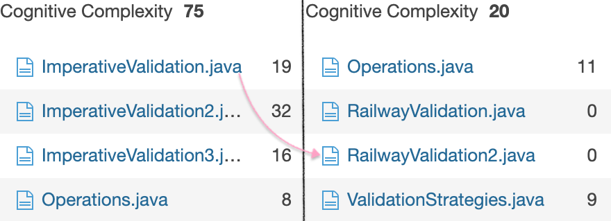

## Abstract

A Metric-driven approach to reduce Cognitive Complexity in a code base, using Functional Programming, demoed **hands-on**, by solving a complex real-world ubiquitous design challenge - REST API Bulk Request Validation, with an extensible Framework that separates what-to-do (Validations) from how-to-do (Validation Orchestration). Let's do a case-study of a successful implementation done by our team in the world's largest SaaS org, _Salesforce_.

## Audience & Takeaways

Technical Level: Interesting to all, approachable for basic and up. Any Functional Programming (FP) enthusiasts love it.

This talk targets developers with basic knowledge of software design. The concepts are language agnostic. For broader outreach, I can use of either of these two for a hands-on demo -- **[Kotlin](https://kotlinlang.org/)** (a Modern Open-source JVM language) + **[Arrow](https://arrow-kt.io/)** (a Trending Open-source functional companion for Kotlin) _(or)_ **Java** + **[Vavr](https://www.vavr.io/)** (an Open-source functional library for Java)

- The audience doesn't need any prior knowledge of FP. They are gradually ramped-up towards Intermediate FP concepts such as _Monads_, _First-Class Functions_, _Higher-Order Functions_, _Function-Lifting_, _Dozen FP Operations for daily Programming like `foldLeft`_ in the context of the problem. They are also provided with appropriate pointers wherever needed, to go back and refer.
- The audience experiences a mind-shift from the traditional mutation-heavy _Imperative style_ to _Functional style_ -- with Immutable Objects (Using Java 14 preview feature `Records` or Kotlin's `Data classes`) and Pure-Functions (replacing Mutation with Transformation).
- With Hands-on demos, this talk adds a powerful paradigm tool-set and vocabulary to a programmer's arsenal and how to use them to simplify the modeling and designing of complex _real-world_ problems.
- The audience learns how to objectively perceive complexity in any codebase through metrics (measured using popular static analysis tools), and how to methodically reduce cognitive complexity.

As I cannot use the production code, I use code samples from my POC for the demonstration -- [Github repo for Java](https://github.com/overfullstack/railway-oriented-validation) or [Github repo for Kotlin](https://github.com/overfullstack/railway-oriented-validation-kotlin).

The code references in this post point to Java repo, but they can be correlated by name with the Kotlin repo.

## Introduction

With the advent of **SaaS** and **Microservices/Macroservices**, software systems majorly communicate through the network, and **REST** is the predominant HTTP protocol used. To reduce network latency, these services resort to _Bulk-APIs_. One of the significant challenges of Bulk-APIs is **Request Validation**. With increasing request bulk size, service routes, and the number of validations, the validation orchestration can quickly get complex when done in traditional imperative style.

Let's take-up a real-world problem. Our Payment Platform service has parallel routes such as Authorization, Capture, Refund, Void. All of these are REST-APIs. They have JSON request payloads that accept sub-requests in bulk (list of JSON nodes). A simplified version of payload for one of the routes - Authorization:

```json
[
    {
        "amount": 99,
        "accountId": "{{validAccountId}}",
        ...,
        "paymentMethod": {
            ...
        },
        ...
    },
    {
        "amount": 77,
        "accountId": "{{validAccountId}}",
        ...,
        "paymentMethod": {
            ...
        },
        ...
    }
]
```

This JSON structure gets marshalled into POJOs, which needs to validated at the entry point of our application layer. Since all services deal with Payments, they have a lot of common fields like `amount`, as well as common child nodes like `paymentMethod` in their structure. Based on the type of field, they have different kinds of validations. E.g.:

- _Simple data validations_ - to validate data integrity for fields like `amount`.
- _Effectful validations_ - for fields like `accountId`, which involves a DB read and is exception prone.
- _Common Validations_ - for common fields such as `amount`, `accountId`, which are common across all service routes.
- _Nested Validations_ for the common child nodes like `paymentMethod`, as it's an independent child node inside a parent.

### The Requirements

The service validation module has the following requirements:

- Share Common and Nested Validations.
- Configure Validation sequence - Cheaper first and Costlier later.
- Fail-Fast for each sub-request.
- Partial failures - An aggregated error response for failed sub-requests can only be sent after valid requests are processed through multiple layers of the application. We have to hold on to the invalid sub-requests till the end and skip them from processing.

## Imperative treatment

We have close to **100 validations** of various kinds and increasing. When the above requirements are dealt with traditional [Imperative Style](https://en.wikipedia.org/wiki/Imperative_programming), it can quickly get messy, as shown [here](https://github.com/overfullstack/railway-oriented-validation/blob/master/src/main/java/app/imperative/ImperativeValidation.java). This code is mutation filled, non-extensible, non-sharable, non-unit-testable, and difficult to reason about.

But to state that objectively, we can run **Cyclomatic Complexity**[$_{[1]}$](https://www.ibm.com/developerworks/java/library/j-cq03316/) and **Cognitive Complexity** [$_{[2]}$](https://www.sonarsource.com/docs/CognitiveComplexity.pdf) metrics on this code, using a popular Code Quality tool called **SonarQube™**[$_{[3]}$](https://docs.sonarqube.org/latest/user-guide/metric-definitions/).

Our current imperative approach records **high** values for both these metrics. (Results to be run and explained during the talk).

## Need for Better Design

### The 3D design problem

This problem is a 3-dimensional design problem stretching among - Sub-requests, service routes (sharing common fields & nodes), and Validation count. In the above imperative approach, we entangled all 3, which lead to chaos. We need a design, which treats all of these separately, let them extend independently, and abstracts out validation sequencing and orchestration. We need to separate *What-to-do* from *How-to-do.*

### Dichotomous Data

We have two types of data floating around throughout our validation program - Valid sub-requests and Invalid sub-requests with Validation Failures. For each sub-request, based on its state, the imperative code flow is continuously branched out with `if-else` and `try-catch` statements, which lead to much of the cognitive complexity. We need a way to represent this valid/invalid **_Effect_** so that our program flows linearly agnostic of the sub-request's validation state.

## The Bulk Validation Framework

### Why FP

We need an extensible framework to cater above design needs. But why is FP the best fit for solving problems like these? Every Software design problem can be seen like a block of objects doing functions or functions processing objects. We have the latter situation, where the sub-requests are being processed (validated) by various validation functions. Whenever there is a situation, where we got to apply a set of operations or transformations on a collection, where output of a function happens to be the input for the subsequent, that's when we should identify it's a FP problem. Please mind, these are transformations and not Mutations.

FP is the best fit to model domains with rich business logic, filled with computations and transformations. That is the reason, it is the first choice for Machine learning, AI, BigData, Reactive Programming etc.

### Immutable POJOs

Making POJOs immutable helps us take out a lot of cognitive load while reasoning about programs. Especially, when our objects are passing through an array of functions, Immutability gives a guarantee that the objects are only being _Transformed_ and not _Mutated_.

With _Java 14 preview_ feature **Records**(https://openjdk.java.net/jeps/359), I shall demo how a class can be easily made immutable - [Ref](https://github.com/overfullstack/railway-oriented-validation/blob/master/src/main/java/app/domain/ImmutableEgg.java)

### Functions as Values

I used Java 8 Functional interfaces to represent the validation functions as values - [Ref](https://github.com/overfullstack/railway-oriented-validation/blob/master/src/main/java/app/declarative/RailwayValidation2.java). This way Validation functions turn more cohesive than the imperative style, can be extended independently from each other and **shared** among various service routes.

### Representing Effect with Either Monad[$_{[4]}$](https://www.vavr.io/vavr-docs/#_either)

In the talk, I shall introduce Monad with a crash course and contextually explain the application of various monads, such as `Option`, `Either`, `Try`, `Stream`.

Let's start with `Either` Monad - It is a data type container that represents the data it contains in 2 states `left` and `right`. We can leverage this *Effect* to represent our Dichotomous Data, where `left: Validation Failure` and `right: Valid sub-request`. Either Monad has operations [API ref] like `map` and `flatMap`, which perform operations on the contained value, only if Monad is in `right` state. This property helps developers write _linear programs_ without worrying about the state of Monad - [Ref](https://github.com/overfullstack/railway-oriented-validation/blob/master/src/main/java/app/declarative/RailwayValidation2.java#L43-L48).

This is a popular technique called **Railway-Oriented-Programming**[$_{[5]}$](https://fsharpforfunandprofit.com/rop/).

### Validations exchange Monad Currency

This *Effect* can be used as a currency to be exchanged as input-output for our independent validation functions. A validation function takes Either monad as input. If the input is in the `right` state, validation is performed using its API functions `map` or `flatMap`, and if the validation fails, the monad is set to the `left` state. Otherwise, return the `right` state received.

### Validation Configuration

Since functions are values, all we need is an Ordered List (like `java.util.list`) to maintain the sequence of validations. We can compose all the validation functions, in the order of preference. This order is easily **configurable** - [Ref](https://github.com/overfullstack/railway-oriented-validation/blob/28eec51549/src/main/java/app/declarative/Config.java#L38-L51).

However, there is a complexity. List of Validations for a parent node consists of a mix of parent node and child node validations. But they can't be put under one `List`, as they are functions on different Data Types. As we can refer in the code, `liftAllToParentValidationType`, which is a **Higher-Order Function** that takes list of child validation functions and **lifts** them to parent validation type - [Ref](https://github.com/overfullstack/railway-oriented-validation/blob/28eec51549/src/main/java/algebra/ConfigDsl.java#L18-L38).

This is a powerful technique, which enables us to see the code through the lens of **Algebra**. This way, we can configure a **Chain** of validations in-order, sorting out all the parent-child dependencies. This is nothing but the most popular **Chain of Responsibility** Design pattern, with a functional touch.

### Validation Orchestration

Now we have 2 lists to intertwine - List of sub-requests to be validated against List of Validations. This orchestration can be easily achieved in many ways due to the virtue of loose coupling between What-to-do(validations) and How-to-do(Orchestration). We can switch orchestration strategies (like fail-fast strategy to error-accumulation or running validations in parallel) without effecting validations code - [Ref](https://github.com/overfullstack/railway-oriented-validation/blob/master/src/main/java/algebra/Strategies.java).

The partial failure sub-requests are captured as Either Monads in `left` state, which are passed to subsequent layers, where they are ignored, thanks to the Either Monad property we discussed above.

### Testability

Individual validation functions are easily testable through unit-tests as they are pure and isolated. The orchestration is completely done using well-tested library functions like `foldLeft`, `findFirst`, etc. So nothing stops us from having a **100% code coverage**.

### Complexity

Thanks to the monad abstracting away all the branching complexity, our linear code has minimum complexity, which makes it easy to extend, debug and reason about. We can rerun the previous complexity metrics to prove it.

As pointed, we can compare [Imperative approach](https://github.com/overfullstack/railway-oriented-validation/blob/master/src/main/java/app/imperative/ImperativeValidation.java) with the [Declarative one](https://github.com/overfullstack/railway-oriented-validation/blob/master/src/main/java/app/declarative/RailwayValidation2.java). Despite the declarative implementation having more validations than imperative implementation, the _Cognitive Complexity_ remains minimum.

## Conclusion

Functional Programming is not Complex, but it fights complexity. The solution runs with the same time complexity (no perf impact), but minimum cognitive complexity. The framework is generic and agnostic of programming language and can be consumed by any Service with similar requirements, with minor modifications.

## My Talk on this

This talk was successfully presented and warmly received at:

- [Kotlin User Group, Berlin](https://youtu.be/uGxx01yYAgk)
- [Google Developer Group Devfest 2019](https://devfest.gdghyderabad.in/speakers.html)
- [Kotlin User Group, Hyderabad](https://youtu.be/LGABy9qdB44)
- [Java User Group Hyderabad (@JUGHyd)](https://www.meetup.com/en-AU/jughyderabad/events/264688807/)
- [Salesforce, Hyderabad, India](http://y2u.be/l9jJ7m7_VpM)

This talk is also selected for a prestigious international conference **[JBCN Conf - 2020](https://www.jbcnconf.com/2020/)** to be held in Barcelona this September.

### Kotlin Version

- The [Slide-deck](https://speakerdeck.com/gopalakshintala/fight-complexity-with-functional-programming-31a15b3d-878e-4b59-94d4-a706c23caadf)
- Source-code links:
  - [imperative-vs-declarative](http://bit.ly/imp-vs-dec)
  - [railway-oriented-validation-kotlin](https://bit.ly/ro-validation-kt)

#### 04-2020

`youtube: uGxx01yYAgk`

#### 05-2020

`youtube: LGABy9qdB44`

### Java Version

- The [Slide-deck](https://speakerdeck.com/gopalakshintala/fight-complexity-with-functional-programming)
- Source-code links:
  - [imperative-vs-declarative](http://bit.ly/imp-vs-dec)
  - [railway-oriented-validation](https://bit.ly/ro-validation)

_(This is only the first presentation of this talk, and there have been many enhancements in later editions)_.

`youtube: l9jJ7m7_VpM`

## References

1. <https://www.ibm.com/developerworks/java/library/j-cq03316/>
2. <https://www.sonarsource.com/docs/CognitiveComplexity.pdf>
3. <https://docs.sonarqube.org/latest/user-guide/metric-definitions/>
4. <https://www.vavr.io/vavr-docs/#_either>
5. <https://fsharpforfunandprofit.com/rop/>

- <http://docs.mipro-proceedings.com/4cows/01_4cows_5333.pdf>
- <http://adit.io/posts/2013-04-17-functors,_applicatives,_and_monads_in_pictures.html#just-what-is-a-functor,-really>
- <https://codurance.com/2018/08/09/the-functional-style-part-1/>
