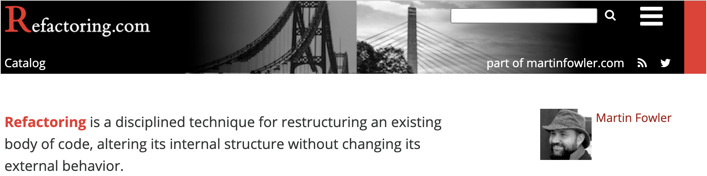
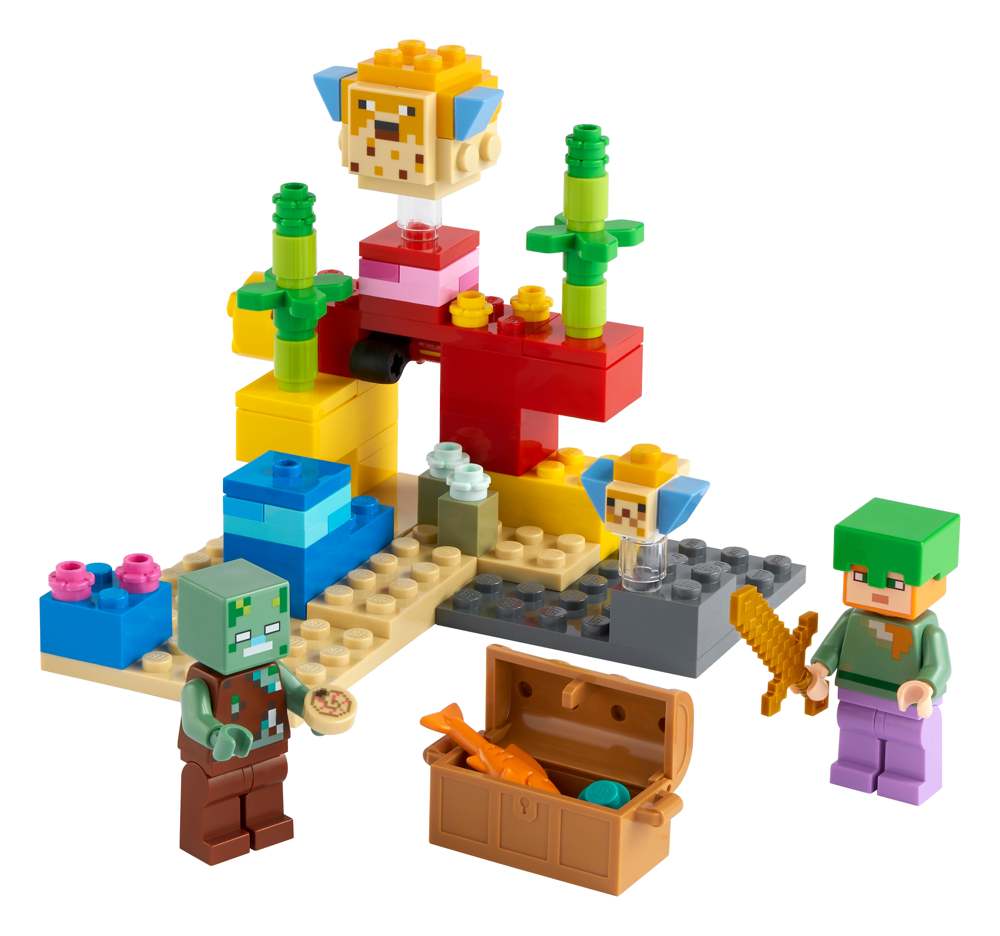
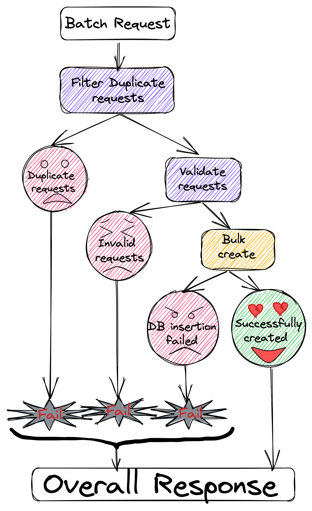
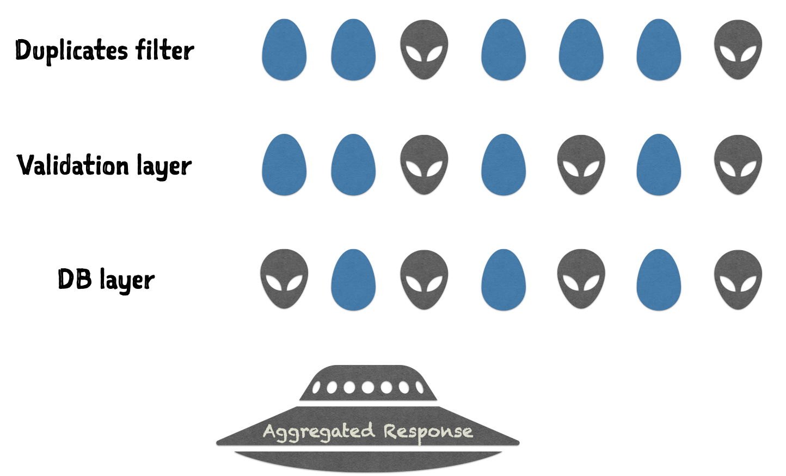
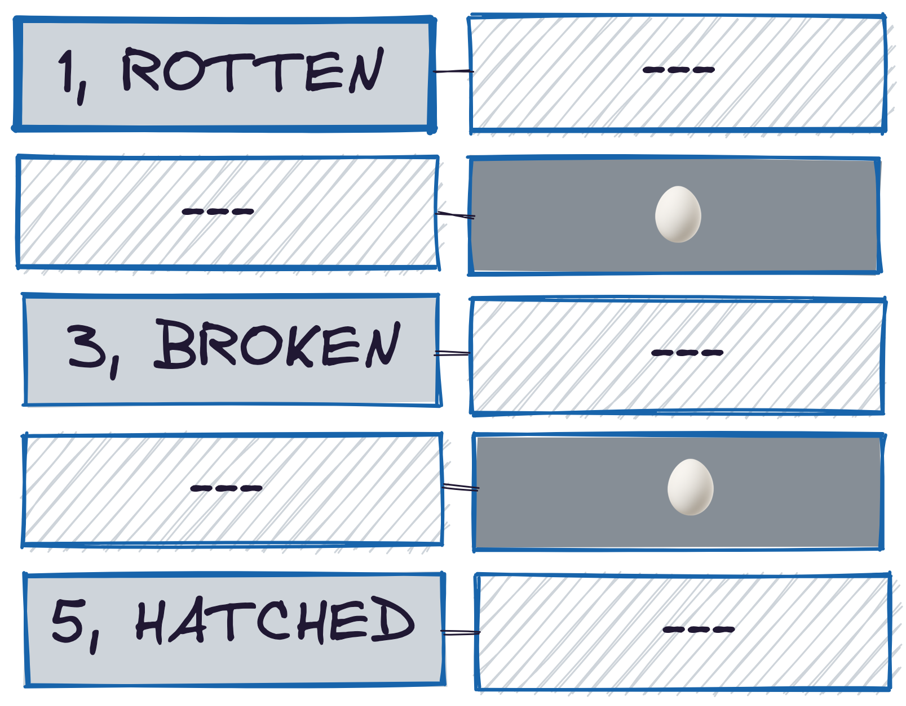
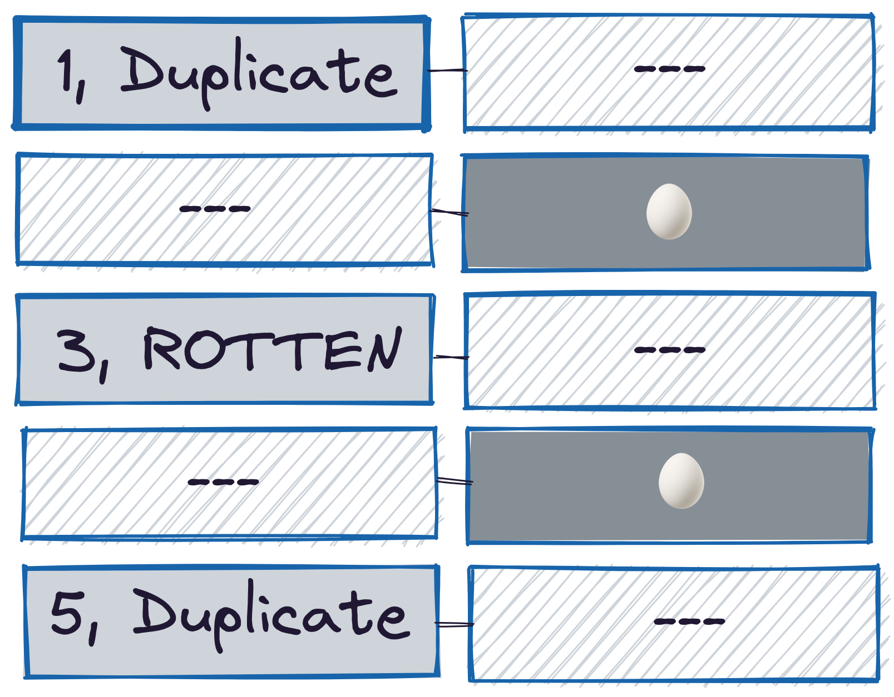

# Abstract

_As a Dev, I need to Refactor, to make the codebase Refactorable_. Refactorability [as defined by Martin Fowler](https://refactoring.com/) is, "The ability to alter internal structure without changing its external behavior". This applies to each atomic component of an app. Let's achieve our dev story through a unique, yet most effective Method, **Component Isolation**.

Let's huddle over persuasive arguments against _Obstacles_ that hinder our goal causing entanglements among components, and _Metrics_ that measure our success.

Let's refactor a real-world app and witness how Isolated components make-up long-lasting structures.

# Audience

This applies to software developers at all levels. I use **Java** to demonstrate the code snippets, but this talk is about Software Design and is agnostic of programming language.

# Takeaways

- How **Isolated components** can makeup long-lasting structures and keep the rate of entropy-growth in check.
- How to use **MOM** process (Methods, Obstacles and Metrics), to build a case for your Refactoring story and pitch it to your team and Manager for funding.
- How **Exceptions** and **Mutation** hinder refactoring goals.
- How to eliminate **Exceptions** from your code using **ADTs (Algebraic Data Types)**.
- How to replace **Shared Global Mutable state on your Shared Codebase** with **Immutability** and **Data Transformations**.
- Demo of a real-world app with these problems and how applying these simple methods can change the face of this service, thereby reducing the cognitive complexity and organically boosting the testability.
- Metric-driven approach to objectively realize the results and improvements achieved.

# Talk Outline

Let's check-out the [definition](https://refactoring.com/) from the person who authored an entire book about it.

> Refactoring is a disciplined technique for restructuring an existing body of code, altering its internal structure without changing its external behavior



- This definition not only applies to your end-to-end application but also applies to each atomic unit that makes it up.
- Refactoring is not just restructuring the existing design or moving lines around with IDE shortcuts.
- Each component should be independent and loosely-coupled, such that you should be able to change its internals without affecting the external behavior, which implies not affecting any of its dependent components.

That brings us to the story of our talk.

## Goal

- **As a Dev, I need to Refactor, to make codebase Refactorable** (That's a recursion!)
- Refactoring is not a one-time activity. And every time you refactor or add a new feature, it's your responsibility to leave the codebase in a state such that it's Refactorable.
- This is just an agile way to say I want to build my components like Lego pieces, Components that can be reused, replaced, and most importantly Composed to form different structures.



Let's follow the [**MOM**](https://www.salesforce.com/blog/how-to-create-alignment-within-your-company/) process to manage our goal. Believe me, Managers love it when you do talk to them in their own language. There are high chances they fund your refactoring in the same release!

## Methods 🛠

We shall only focus on a couple of important **Methods** to achieve our goal:

- **Human Readability**
  - Refactoring is for humans, machines can run any shitty code.

- **Component Isolation**
  - How independent and loose coupled my components are?
  - Are the effects of my component reaching farther than they should?

## Obstacles 🧗🏼

And a couple of major **Obstacles** that sabotage those:

- First up, we shall start with the most abused language feature, any guesses? - **Exceptions** and see how they bind a function to an entire call stack.
- Next, something that creates an even more invisible and unholy coupling - **Mutability**

## Metrics 📐

And the **Metrics** to keep a check on our goals:

- **Cognitive Complexity** - which is inversely proportional to **Readability**
- **Testability** - Indicates how isolated your components are, to be composed and reused.

We shall apply those methods on a **real-world application** and realise how it's metrics are affected.

Let's start with Obstacles and how to overcome them:

## [Throw away Exceptions 👽](/posts/throw-away-exceptions)

## [Mutation is Unholy 👹](/posts/mutation-is-unholy)

---

# Hello-real-world 🪐

Let's see how some of what we talked, fits into a **Real-world application**

## The Flow



- Assume this is a backend service for a Batch API, which gets a list of JSON.
- Request is marshalled into POJOs, which are filtered and validated in multiple layers.
- Based on the results, we build a batch response to send back in the end.

## Partial Failures



- But the catch is, we need a way to handle partial failures. A batch API must hold on to all those failures till the end and skip them from getting processed further down, so that we can send an aggregated response in the end.
- We are not interested on the failed ones, but the reasons why they failed, which is a different data type `Failure`.
- The inability to pass and return results of two data types (`Failures` and `Egg`), and to handle partial failures, the first _default_ choice was to use a `HashMap`, which is passed in and out of each step in the flow.

```java
void filterDuplicates(Map<ID, Failure> failureMap,
    List<Egg> eggsFromRequest) {...}

void validate(Map<ID, Failure> failureMap,
    List<Egg> nonDuplicateEggs) {...}

List<EggEntity> toEntityObjs(List<Egg> validEggs) {...}

void bulkInsertIntoDB(List<EggEntity> eggEntityObjs)
		throws DMLOperationException {...}
```

- It is also used to filter _valids_ from _Invalids_ after each step.

```java{3-9}
filterDuplicates(failureMap, eggsFromRequest);

// Partition
var nonDuplicateEggs = new ArrayList<Egg>();
for (Egg egg : eggsFromRequest) {
  if (!failureMap.containsKey(egg.getId())) {
    nonDuplicateEggs.add(egg);
  }
}

validate(failureMap, nonDuplicateEggs);
...
// Partition
...
var eggEntityObjs = toEntityObjs(validEggs);

try {
  bulkInsertIntoDB(eggEntityObjs);
} catch (DMLOperationException ex) {
  handlePartialFailures(failureMap, ex);
}

// Prepare response from `failureMap` and db insertion `results`
```

This flow has all the problems we discussed before. Let's apply our methods and see how this can be Refactored into.

## The Signature Shift

We can use `Either` to represent the partial failures. This eliminates the need of a temporary data structure like `HashMap`, coz now both _Valids_ and _Failures_ can share the same `List`

```java
// Before
void filterDuplicates(Map<ID, Failure> failureMap,
    List<Egg> eggsFromRequest) {...}

// After
static List<Either<Tuple2<ID, Failure>, ImmutableEgg>> filterDuplicates(
    final List<ImmutableEgg> eggsFromRequest) {...}
```

- This is how a `List<Either<Tuple2<ID, Failure>, ImmutableEgg>>` can be visualized.



- Either is switched from `right` to `left` state if it fails downstream.



- This also avoids the need for intermediate filtering between steps, coz all the failures contained in `Either.left` are auto skipped from processing downstream. This is possible due to the **Monad** property of `Either`.

```java
static Either<Tuple2<ID, Failure>, ImmutableEgg> validate(
  Either<Tuple2<ID, Failure>, ImmutableEgg> eggToValidate) {
  return eggToValidate // No validations execute if egg is Either.left
    .flatMap(validateAge)
    .flatMap(validateField1)
    ...
    ...
    ;
}
```

Monads is out of scope to be covered here, but I have an entire 1 hour talk about this, which can help you fill this missing piece:
  - [Java Version](/my-talks/#Fight-Complexity-with-Functional-Programming-Java)
  - [Kotlin Version](/my-talks/#Fight-Complexity-with-Functional-Programming-Kotlin)

## Refactored into Isolated Pieces 🏝

This is how we refactored these components into isolated pieces.

```java
// void filterDuplicates(Map<ID, Failure> failureMap,
//    List<Egg> eggsFromRequest) {...}
static List<Either<Tuple2<ID, Failure>, ImmutableEgg>> filterDuplicates(
    final List<ImmutableEgg> eggsFromRequest) {...}

// void validate(Map<ID, Failure> failureMap,
//    List<Egg> nonDuplicateEggs) {...}
static Either<Tuple2<ID, Failure>, ImmutableEgg> validate(
    final Either<Tuple2<ID, Failure>, ImmutableEgg> egg) {...}

// List<EggEntity> toEntityObjs(List<Egg> validEggs) {...}
static Either<Tuple2<ID, Failure>, EggEntity> toEntityObj(
    final Either<Tuple2<ID, Failure>, ImmutableEgg> egg) {...}

// Partition

// void bulkInsertIntoDB(List<EggEntity> eggEntityObjs)
//    throws DMLOperationException {...}
static Either<DMLOperationException, List<EggEntity>> bulkInsertIntoDB(
    final List<EggEntity> eggEntityObjs) {...}
```

But most importantly, they fit into each other, resembling a _math derivation_.

## Let's play some Lego

All these isolated pieces elegantly fit together, like Lego, groove-to-groove.

```java
final var partition = filterDuplicates(immutableEggsFromRequest).stream()
  .map(EggService::validate)
  .map(EggService::toEntityObj)
  .collect(Collectors.partitioningBy(Either::isRight));

final var objsToInsert =
  partition.get(true).stream().map(Either::get).toList();

final var results = bulkInsertIntoDB(objsToInsert);
// Prepare response from `partition.get(false)` and `results`
```

---

# Metrics

How are we doing on our Goal! let's ask our Metrics:

## Cognitive Complexity

I don't need any metrics to say that the refactored code is more readable. But for few, that might not be the case. I heard some say this is more "Complex". Complexity is a wide word thrown around loosely. Before labelling something complex, we need to be clear to ourselves, as well as others about what is Complex.

Complexity has different types:

- Accidental Complexity
- Essential complexity
- Cognitive/Cyclomatic complexity

It has Different layers too:

- Unfamiliarity vs Unreadability.
- Strict vs Non-extensible.

The refactored code may feel complex because:

- Essential Complexity - Due to all filtering, validations and handling partial failures.
- Unfamiliar - Not everyone might have got a chance to work with Java 8 syntax, or they haven't heard of `Either` before.
- Strict - We intentionally induced this strictness. Unlike earlier implementation where the Developer can imperatively mutate stuff, now he no more is in control. Declarative transformations already paved lanes to drive with discipline leaving him partial control and no shortcuts. For someone who is conditioned to Mutation, it feels like "Coding with hand-cuffs".

That said Cognitive Complexity can be Objectively measured using tools like [SonarQube™](https://docs.sonarqube.org/latest/user-guide/metric-definitions/).
- My previous talks, on the usage of **SonarQube™**:

  - [Java Version](https://overfullstack.ga/my-talks/#Fight-Complexity-with-Functional-Programming-Java)
  - [Kotlin Version](https://overfullstack.ga/my-talks/#Fight-Complexity-with-Functional-Programming-Kotlin)

## Testability

If you followed the methods we discussed, you get _Testability_ for free. Well, most of it. There are just few more that you can follow to boost it further.

### Separate Static from Signal

Take the example of this simple function, which maps the request object to entity object.

```java
// * EggEntity is a legacy class and cannot be instantiated with `new`
void fillEntityObj(Egg egg, EggEntity eggEntity) {
  if (egg.field1() != null) {
    eggEntity.put(Fields.field1, egg.field1());
  }
  if (egg.field2() != null) {
    eggEntity.put(Fields.field2, egg.field2());
  }
  if (egg.field3() != null) {
    eggEntity.put(Fields.field3, egg.field3());
  }
}
```

How do you unit test all these branches? Also, because the `EggEntity` can't be instantiated in a unit test context, we tend to write a test like this:

```java
@Test
void fillEntityObjTest() {
  // * `EggEntity` Object can't be instantiated in a JUnit context.
  final var mockEggEntity = mock(EggEntity.class);
  var egg = new Egg("field1Value", null, "field3Value");
  fillEntityObj(egg, mockEggEntity);
  verify(mockEggEntity).put(Fields.field1,"field1Value");
  verify(mockEggEntity, never()).put(Fields.field2, null);
  verify(mockEggEntity).put(Fields.field3,"field3Value");
}
```

## A Brittle Test
- This test is _Brittle_, because:
  - `Unit Test !== Test Internals`
  - `Unit Test === E2E test for Unit`.
- Unit tests doesn't mean test the internals. It's an E2E test for your Unit/Component.
- You should respect encapsulation of each unit/component you test and operate on an abstraction one-level above.
- Your test should be like an idiotic bot which fires your function with an input and asserts the output. It's not supposed to know anything else about your component code.
- If it's asking for internals, it gets tightly latched with your component, which tends to fail every time you refactor. Such tests instead of helping, act as a foot-chain for refactoring.

## Make code Testable

Solution is not to write better test but make the main code _Testable_. Let's see our method closely, you can observer Static mixed with Signal:
    - **Static:**  1-1 field mapping between `Egg` to `EggEntity`
    - **Signal:** For each field mapping, fill non-null `Egg` fields into `EggEntity` using `put`.

Let's do the same in code:

```java{14, 17-19}
// Static
static final Map<String, Function<ImmutableEgg, String>> fieldMapping = Map.of(
  Fields.field1, ImmutableEgg::field1,
  Fields.field2, ImmutableEgg::field2,
  Fields.field3, ImmutableEgg::field3);

// Call with Static data and Function reference
fillEntityObj(egg, fieldMapping, EggEntity::put);

// Signal
static void fillEntityObj(
    ImmutableEgg egg,
    Map<String, Function<ImmutableEgg, String>> fieldMapping
    BiConsumer<String, String> filler) {
  fieldMapping.forEach((fieldId, valueGetter) -> {
    final var fieldValue = valueGetter.apply(egg);
    if (fieldValue != null) {
      filler.accept(fieldId, fieldValue);
    }
  });
}
```

- Now, We can focus on testing just the signal part.
- This [BiConsumer](https://docs.oracle.com/en/java/javase/11/docs/api/java.base/java/util/function/BiConsumer.html) is agnostic of what's passed, so we can cleverly use a `HashMap::put` to test this function.
- As our code turns testable, we don't need magical mocking frameworks or **over-granular testing** to achieve ~95% test-coverage. We can easily write highly targeted tests.

## DI

Unit tests hate side-effects. All your objects used to perform side-effects should be declared as constructor dependencies or method params, so you can stub them for unit tests. Something like this:

```java
@Autowired
public EggService(
  ...,
  @Qualifier(EGG_REPO) EggRepo eggRepo,
  ...
)
```

But if all you need is a function from a Dependency, resist to inject the entire the entire object. Instead, inject only the function that you need.

```java
@Autowired
public EggService(
  ...,
  // @Qualifier(EGG_REPO) // EggRepo eggRepo,
  @Qualifier(EGG_INSERTER) Function<EggEntity, ID> dbInserter,
  ...
)

// Main Config
@Bean(EGG_INSERTER)
public Function<EggEntity, ID> insert(
  @Qualifier(EGG_REPO) EggRepo eggRepo) {
  return eggRepo::insert;
}

// Test Config
@Bean(EGG_INSERTER)
public Function<EggEntity, ID> insertNoOp() {
  return eggEntity -> new ID(1); //stub
}
```

This helps in easy stubbing of this dependency without the need for a mock, and we get the same benefits that we discussed in [Separate Static from Signal](#separate-static-from-Signal)

## Testability First, Test Coverage follows 🐕

Notice, I use the word _Testability_ over _Test Coverage_. Testability indicates how precisely you can hit a component without the need to mock a lot of things or know it's internals. Test coverage is just a metric. It's very much possible to achieve 100% Test coverage without your code being testable. Such synthetic-coverage of-course is useless.

# Last but not the Last

## Test 🏓 Refactor

Tests should not be an after-thought and should happen parallel to Refactor, like a ping-pong.

## Entropy

- **Entropy is the price of a Structure**. No matter how much we refactor, as we build more features and as more resources quit and join, entropy is meant to increase. The goal is to keep its rate of growth to check, like a logarithmic curve instead of a linear or exponential curve.
- But never get too adventurous and refactor half your codebase, especially when you don't have tests, you may end-up in a situation like this:
- Always refactor incrementally, as prescribed by TDD, have tests to back your component and you are free to refactor it to perfection any day. But today, you only need _Good enough!_

> Even bad code can function. But if the code isn't clean, it can bring a development organization to its knees - Uncle Bob, Clean code

# Resources

- [Slide-deck](https://bit.ly/h2a-deck)
- [Source-code](https://bit.ly/h2a-code)

# My Talks on this

- 🇪🇸 [**JBCN Conf**](https://www.jbcnconf.com/2021/infoSpeaker.html), 2021, Barcelona, Spain.

`youtube: https://www.youtube.com/watch?v=Ip8SvyXLvD8&list=PLrJbJ9wDl9EC0bG6y9fyDylcfmB_lT_Or&index=1`

- 🇮🇳 [**Functional Conf**](https://confengine.com/conferences/functional-conf-2022/proposal/16085/huh-to-aha-a-refactoring-story), 2022, India.

`youtube: https://www.youtube.com/watch?v=MVnfndMW9zo&list=PLrJbJ9wDl9EC0bG6y9fyDylcfmB_lT_Or&index=1`

- 🇩🇪 [**WeAreDevelopers World Congress**](https://www.wearedevelopers.com/world-congress/speakers#:~:text=Architect%20at%20smapiot-,Gopal,-S%20Akshintala), 2022, Berlin, Germany.

- 🇪🇺 **[jLove](https://embed.emamo.com/event/jlove-2021/r/speaker/gopal-s-akshintala)**, 2021, Europe.
