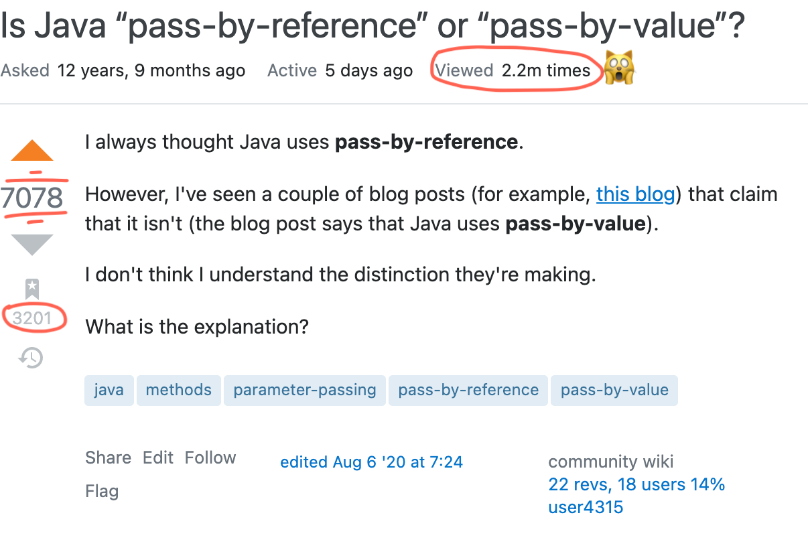

> This is a part of this post: [$card](https://overfullstack.github.io/posts/huh-to-aha)

# The Entanglement

Mutability causes a lot of problems, especially the **Shared mutable state on a Shared Codebase**. Let's focus on how it hinders the goal of Component Isolation.

## Mutable Objects as Input params

- This is just a simple function, which takes a list of numbers and sums them up.

```java
static int sum(List<Integer> nums) {
  int result = 0;
  for (int num : nums)
    result += num;
  return result;
}
```

- Let's say a developer wanted to extend its functionality to calculate absolute sum and wanted to reuse `sum` like this:

```java
static int sumAbsolute(List<Integer> nums) {
  for (int i = 0; i < nums.size(); i++) {
    nums.set(i, Math.abs(nums.get(i)));
  }
  return sum(nums); // DRY
}
```

- Now a client uses it, and everything worked, they released it and had a GA party! 🥳

```java
static void client() {
  var nums = Arrays.asList(-2, 5, -6);
  System.out.println(sumAbsolute(nums));
}
```

- Some day after the release, a developer wanted to insert this line in the client code, and he got this unholy result.

```java{4}
static void client() {
  var nums = Arrays.asList(-2, 5, -6);
  System.out.println(sumAbsolute(nums));
  System.out.println(sum(nums)); // 13 👺
}
```

- After a painful debugging session, he found a bug; that has been waiting to bite him -- A **Latent Bug**.

```java{3,11}
static int sumAbsolute(List<Integer> nums) {
  for (int i = 0; i < nums.size(); i++) {
    nums.set(i, Math.abs(nums.get(i))); // Latent Bug 🐞
  }
  return sum(nums); // DRY
}

static void client() {
  List<integer> nums = Arrays.asList(-2, 5, -6);
  System.out.println(sumAbsolute(nums));
  System.out.println(sum(nums)); // 😬
}
```

Because the `sumAbsolute` received a reference to a mutable object, it assumed it as a license to do any mutations on it. To me the mistake lies with the `client`, who passes-around a mutable object reference. This mutable object acts as an invisible string, coupling the components `sumAbsolute`, `client` and `sum`. Thus, Mutable objects as Input params are **Unholy** for isolation.

## Mutable Objects as Return types

Well, that's even more dangerous. Let's see with an example: This is a function, which takes an `eggId` and fetches its laying date by doing a heavy DB operation.

```java
Date getEggLayingDate(int eggId) {
  // heavy operation
  return queryEggLayingDateFromDB(eggId);
}
```

- Assume, it has two dependent components, independent of each other. Assume both these components are present in two different modules.

```java{3,11}
// Dependent component - 1
boolean isLaidInFirstHalf(int eggId) {
  var layingDate = getEggLayingDate(eggId);
  if (layingDate.getDate() < 15) {
    return true;
  }
  return false;
}

// Dependent component - 2
int calculateEggAge(int eggId, Date today) {
  return today.getDate() - getEggLayingDate(eggId).getDate();
}
```

- They are all in harmony, everything is working great. One day! a developer wanted to add a trivial log in `hasEggRotten`.
- As a date object is not used anymore in this function, he felt he could reuse this object to get month and year information and so he mutated it like this:

```java{5-7}
// Dependent component - 1
boolean isLaidInFirstHalf(int eggId) {
  var layingDate = getEggLayingDate(eggId);
  if (layingDate.getDate() < 15) {
    // It's just logging, let's reuse the same Date obj for month and year
    layingDate.setDate(15);
    logger.info("This egg was laid before: " + layingDate);
    return true;
  }
  return false;
}
```

- As he expected, there were no problems reported. Another day! the developer of `getEggLayingDate` felt there is an opportunity to optimize his DB heavy component and so implemented caching like this.

```java
static final Map<Integer, Date> eggLayingDateCacheById =
  new HashMap<>(); // Cache
Date getEggLayingDate(int eggId) {
  return eggLayingDateCacheById
    .computeIfAbsent(eggId, this::queryEggLayingDateFromDB);
}
```

- He tested his component, and it's working great and so they released it.
- Now, guess who gets the bite this time? The innocent `calculateAge` component which has no changes!

```java
// Dependent component - 2
long calculateEggAge(int eggId, Date today) {
  return today.getDate() - getEggLayingDate(eggId).getDate(); // What did I do? 😿
}
```

- We just witnessed, how components separated by modules can be entangled with Mutable Objects. It's almost impossible to refactor them without breaking anything.
- On a real code base, this is even more intertwined. Most of our debugging cycles are spent to bash bugs like these. It resonates with the universal developer experience - "Fix this breaks that".
- I call this a **Quantum Entanglement!** ⚛🧙🏼‍♀️

## References Everywhere

It's not just the Mutable objects but Java has pointers all around. References are writable by default.



Looking at the numbers of views, up-votes and bookmarks, I am sure a lot of developers have been bitten by this.

## But why is Mutability Predominant in Java code?

Because historically it has been the default mode in Java, and defaults are powerful. We all heard Google pays Apple a fat cheque every year just to keep google as default search engine. People seldom change defaults.

## It takes **Discipline** to beat the **Default**

- Just like how we work-out every day and how we need to follow traffic rules. Remember, traffic rules are not made for good drivers. Even if there are 99 good ones, one bad driver can create havoc on the road.
- We cannot depend on developer niceties and expect them to follow some coding-guidelines documented somewhere which no one refers.
- It's important we imbibe those restrictions into our design by effectively using the language features.

### Some Quick wins 🍒

- Make a habit to use final before var and function params to guard your references.
- Follow Immutable strategy for POJOs from [Oracle's Documentation](https://docs.oracle.com/javase/tutorial/essential/concurrency/imstrat.html)
- (Pre Java 16) Auto-generate Immutable version of your POJO using:

  - [Lombok](https://projectlombok.org/features/Value) **(More Magic, Less Effort)**
  - [Google Auto](https://github.com/google/auto) **(Less Magic, More Effort)**
  - [Immutables](https://immutables.github.io/) **(Less Magic, More Effort)**

- Use `Record` types from Java 16

# Anti-Immutables

Some prevailing arguments about Immutability

## Isn't Immutability only for _Multi-threading_?

- Whenever I try to convince these old school java programmers, who are conditioned to mutability, I get this question a lot: "But isn't immutability just for multi-threading? Why do I need it if my app is Single Threaded?"
- Let me remind you, the app running on your machine may be single-threaded, but the one running in your skull is not.


- It's by default concurrent, with all the distractions. Plus, it doesn't come with a built-in debugger.
- With mutable objects, you need to build-up all that state in your head, and a simple distraction can puff it all up. Immutability eliminates that, by-definition.
- Hope that answers this question.

## _Immutable_ Objects doesn't fit my _Imperative_ style?

Mutation and imperative are super good friends, and one likes to be with the other.

```java{2,8}
void mutableFn() {
  var mutableList = Arrays.asList("a", "b", "c");
  mutateList(mutableList);
}

List<String> mutateList(List<String> list) {
  for (var i = 0; i < list.size(); i++) {
    list.set(i, list.get(i).toUpperCase());
  }
  return list;
}
```

But if you use _Immutable_ objects, you _need_ to replace your _Imperative mutations_ with _Declarative transformations_.

```java{2,8}
void immutableFn() {
  final var immutableList = List.of("a", "b", "c");
  transformList(immutableList);
}

List<String> transformList(final List<String> list) {
  // `toList()` is new in Java 16 to collect Stream into UnmodifiableList.
  return list.stream().map(String::toUpperCase).toList();
}
```

- Immutability and Transformations are like **Couple**. They ought to live together, no choice! ;)
- If you try to perform mutation on an immutable object, you get an exception right on your face

```java{3,4}
void immutableFn() {
  final var immutableList = List.of("a", "b", "c");
  // ! Throws UnsupportedOperationException ⛔️
  mutateList(immutableList);
}
```

**Immutability forces Transformation** (Now I don't have to tell you, who is the wife and who is the husband! 😉)

## Doesn't Immutability affect Perf?

- Immutability may lead to creating more objects. But let's see what Oracle says:
- ctrl-c + ctrl-v from [Oracle's Documentation](https://docs.oracle.com/javase/tutorial/essential/concurrency/immutable.html)

  - **The impact of object creation is often overestimated**.
  - It can be offset by **decreased overhead due to garbage collection**.

- Period!

## Java's embracing Immutability, slowly

- Most used Data type in any Java application? `String`, No coincidence that it's Immutable.
- Java 8 replaced `Date` with immutable `LocalDate`.
- Java 11 introduced Immutable Collections.
- Java 16 introduced `Record` types and a concise Stream operation `toList` for UnmodifiableList.

Any many more. The tide's turning! 🌊

# My Talks on this

- 🇪🇸 **[JBCN Conf](https://www.jbcnconf.com/2021/infoSpeaker.html)**, 2021, Barcelona, Spain.

`youtube: https://www.youtube.com/watch?v=Ip8SvyXLvD8&list=PLrJbJ9wDl9EC0bG6y9fyDylcfmB_lT_Or&index=1`

- 🇪🇺 **[jLove](https://embed.emamo.com/event/jlove-2021/r/speaker/gopal-s-akshintala)**, 2021, Europe.
- 🇮🇳 **[Functional Conf](https://confengine.com/conferences/functional-conf-2022/proposal/16085/huh-to-aha-a-refactoring-story)**, 2022, India.
