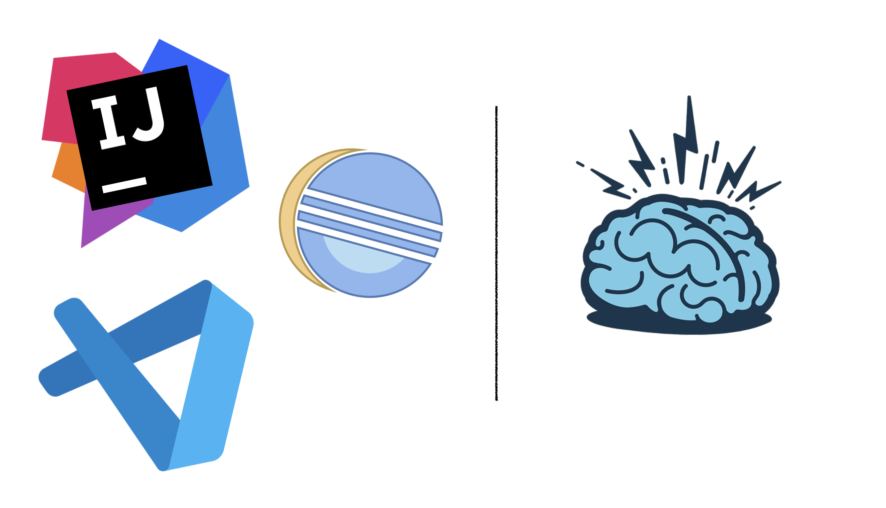

# Exceptions are the most abused language feature

Although exceptions are introduced into Java language with good intentions, a developer can catch, throw, or duck any exception, making them the most abused language feature.

```java
try {
  ...
} catch(NullPointerException | IllegalArgumentException | IndexOutOfBoundsException e) {
  e.printStackTrace();
}

try {
  ...
} catch(Exception e) {
  throw e;
}
```

You need to hunt down all throws and re-throws and multiple catch blocks, playing the dangerous game of inheritance.

# Exceptions are Worm Holes



- Whenever you are reading someone's code or your own code after a while for that matter, 2 IDEs run, one on your laptop and another in your head. The laptop IDE is the one that takes its sweet time to index everything and gobbles up half your ram, (they got too greedy these days).
- The other one, the poor one, which runs in your skull, slowly reads line-by-line, and tries to make-up a picture of what's going-on. If you're like me with an extremely limited working memory and got ADHD on top of it, please don't throw exceptions.
- Exceptions are famously called modern `goto`s. I would say they are Worm holes in the code which can teleport your execution point to places unexpected.
- And I am not even going into Async and Concurrent realms, where you add an extra dimension to this catching game called **Threads**.
- Therefore, modern JVM languages like Kotlin are going away from the concept of **Checked Exceptions**. You shouldn't force developers to catch exceptions, they will if they need to handle.
- This poor method is trying to convey a result that something is wrong, or Nothing is wrong. But it's struggling to convey this **effect of absence** and resorted to `throws`, because of which, this is tightly latched, not just to its caller but the entire call-hierarchy.

```java
void verifyUserAccess(String userId) throws NoAccessException {
if (!hasAccess1(userId)) {
  throw new NoAccessException(ACCESS_1);
}
if (!hasAccess2(userId)) {
  throw new NoAccessException(ACCESS_2);
}
if (!hasAccess3(userId)) {
  throw new NoAccessException(ACCESS_3);
}
}
```

- In this case, `Optional` is the right fit to represent that effect of absence.

```java
Optional<NoAccessException> verifyUserAccess(String userId) {
if (!hasAccess1(userId)) {
  return Optional.of(new NoAccessException(ACCESS_1));
}
if (!hasAccess2(userId)) {
  return Optional.of(new NoAccessException(ACCESS_2));
}
if (!hasAccess3(userId)) {
  return Optional.of(new NoAccessException(ACCESS_3));
}
return Optional.empty();
}
```

Now, this function is turned into an isolated piece! 🏝

## Replace Exceptions with ADTs

- All Exceptions can be replaced with [ADTs (Algebraic Data Types)](https://www.raywenderlich.com/11593767-functional-programming-with-kotlin-and-arrow-algebraic-data-types), unless they are exceptional. Few commonly used ADTs are:

  - [Optional](https://docs.oracle.com/en/java/javase/11/docs/api/java.base/java/util/Optional.html) - some OR none
  - [Tuple (VAVR)](https://docs.vavr.io/#_tuples) - 1 WITH/AND 2
  - [Either (VAVR)](https://docs.vavr.io/#_either) - left OR right

With the advent of **Pattern Matching in** Java 16+**, these turn more natural to be used in Java going forward.

- That's not it, Exceptions are misused to return multiple data types.

```java
int parse(String s) {
  if (s.matches("-?[0-9]+")) {
    return Integer.parseInt(s);
  }
  throw new NumberFormatException("Not a valid integer");
}
```

- An `Either` can be the right fit here:

```java
Either<NumberFormatException, Integer> parse(String s) {
  if (s.matches("-?[0-9]+")) {
    return Either.right(Integer.parseInt(s));
  }
  return Either.left(new NumberFormatException("Not a valid integer"));
}
```
