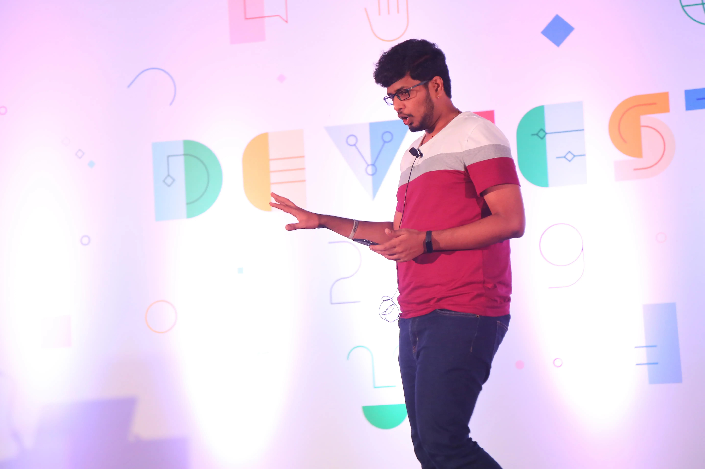

Decent at Math and loves Physics, a right-brainer who loves being creative and that ended-him-up choosing _Programming_ as his day-job. He loves what he does!

**Gopal S Akshintala** is currently a **Lead Software Engineer at Salesforce**, working on Scaling Backend Systems for Revenue Cloud.

He is a passionate developer and loves being an **Influencer & Mentor** in the dev community through his Blog-posts,
[International Tech-Talks](/my-talks), and Social-media.
He started as an Android Developer and switched to the server-side as a Full-Stack Developer (Backend - Kotlin, Java | Frontend - React Js). 
Wearing multiple hats, aided him to perceiving Patterns, Solutions, and Trade-offs.
He is a practitioner of Domain-Driven Design(DDD) and Clean Architecture.
A massive fan of Test-Driven Development(TDD).
He believes Expressive Code is fun and profitable, which enthused him towards Functional Programming(FP).
He's a language geek, currently fluent in Kotlin, Java.

In addition to his Software Engineering experience, he gains more _experiences-per-year_ by open-source collaborations & contributions, 
active participation in the Dev discussions, and Speaking at User Groups and Conferences. 
He loves being on Stage, as a Singer ([SoundCloud](http://bit.ly/agssc) | [Youtube](https://youtube.com/playlist?list=PLrJbJ9wDl9EB5lKs1L13pJDOKp9yg0YF9)) 
and a Tech-Speaker and writes about [Nature & Life](https://leafonthewind.ga).

[Résumé](http://bit.ly/ags-my-resume)
