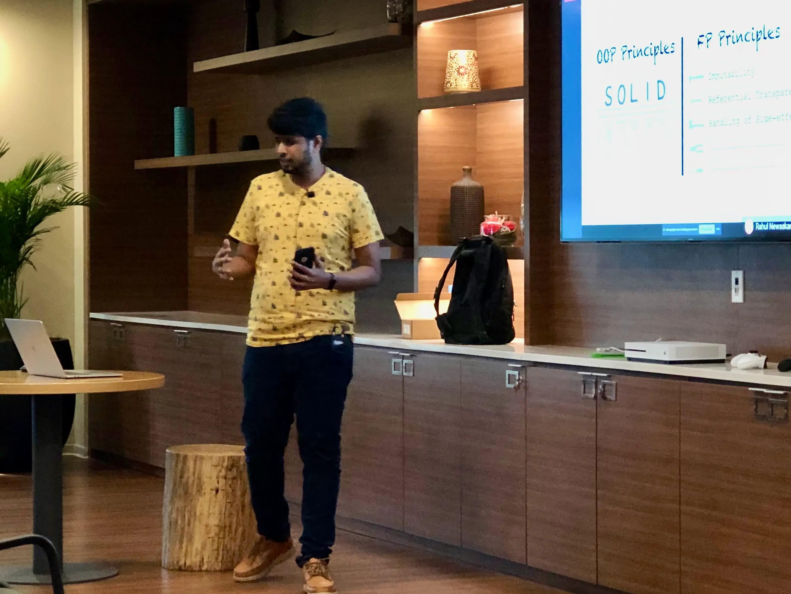

Gopal is an International Speaker, with his Tech-Talks being warmly received at:

- 🇮🇳 [Chennai JVM Community](https://www.youtube.com/watch?v=1p-n1q0bjFI&list=PLrJbJ9wDl9EC0bG6y9fyDylcfmB_lT_Or&index=1)
- 🇮🇳 [**Google Developer Student Club, Osmania University**](https://www.linkedin.com/posts/sreeja-pottabathula-56126a259_androidworkshop-kotlin-functionalprogramming-activity-7165614338626584576-BX_Y), Hyderabad, 2023
- 🇮🇳 [**Google Developer Group Devfest**](https://www.linkedin.com/posts/gdghyd_devfest-gdghyderabad-apiautomation-activity-7135551611447242753-q4C6), Hyderabad, 2023
- 🇮🇳 [**Open-Source India (OSI) Conf**](https://www.youtube.com/watch?v=YxeRddSFkxc&list=PLrJbJ9wDl9EC0bG6y9fyDylcfmB_lT_Or&index=1), Bengaluru, 2023. [📃](https://www.opensourceindia.in/osi-speakers-2023/gopala-sarma-akshintala/)
- 🇮🇳 **TMP Connections Tour**, Bengaluru, 2023
- 🇮🇳 [**TMP Horizon**](https://www.youtube.com/watch?v=n849hcp6jkg&list=PLrJbJ9wDl9EC0bG6y9fyDylcfmB_lT_Or&index=1), Hyderabad, 2022
- 🇮🇳 [**Google Cloud Community Days**](https://gdg.community.dev/events/details/google-gdg-cloud-hyderabad-presents-cloud-community-days-hyderabad-2022-1/), Hyderabad, 2022
- 🇩🇪 [**WeAreDevelopers World Congress**](https://www.wearedevelopers.com/world-congress/speakers#:~:text=Architect%20at%20smapiot-,Gopal,-S%20Akshintala), 2022, Berlin, Germany.
- 🇮🇳 [**Git the Core on, May the perForce be Gone**](https://www.youtube.com/watch?v=YjtsQ-JjodM&list=PLrJbJ9wDl9EC0bG6y9fyDylcfmB_lT_Or&index=1), 2022
- 🇮🇳 [**Functional Conf**](https://www.youtube.com/watch?v=MVnfndMW9zo&list=PLrJbJ9wDl9EC0bG6y9fyDylcfmB_lT_Or&index=1), 2022, India. [📃](https://confengine.com/conferences/functional-conf-2022/proposal/16085/huh-to-aha-a-refactoring-story)
- 🇪🇸 [**JBCN Conf**](https://www.youtube.com/watch?v=Ip8SvyXLvD8&list=PLrJbJ9wDl9EC0bG6y9fyDylcfmB_lT_Or&index=1), 2021, Barcelona, Spain. [📃](https://www.jbcnconf.com/2021/infoSpeaker.html)
- 🇺🇸 [**Vader & the Army of Validators**](https://www.youtube.com/watch?v=NuD32oEjfWk&list=PLrJbJ9wDl9EC0bG6y9fyDylcfmB_lT_Or), 2021, Season of Innovation, Salesforce
- 🇪🇺 [**jLove**](https://embed.emamo.com/event/jlove-2021/r/speaker/gopal-s-akshintala), 2021, Europe.
- 🇺🇸 [**All Things Open**](https://www.youtube.com/watch?v=Dvr6gx4XaD8&list=PLrJbJ9wDl9EC0bG6y9fyDylcfmB_lT_Or&index=1), 2020, Raleigh, USA. [📃](https://2020.allthingsopen.org/speakers/gopal-s-akshintala/)
- 🏴󠁧󠁢󠁥󠁮󠁧󠁿 [Kotlin User Group, London](https://www.youtube.com/watch?v=QVuMSsIUw6M&list=PLrJbJ9wDl9EC0bG6y9fyDylcfmB_lT_Or&index=2)
- 🇩🇪 [Berlin Functional Programming Group](https://www.youtube.com/watch?v=DBDTNmLbU2Y&list=PLrJbJ9wDl9EC0bG6y9fyDylcfmB_lT_Or&index=3)
- 🇳🇴 [JavaBin, Norway](https://www.youtube.com/watch?v=tnpL1O8kTbM&list=PLrJbJ9wDl9EC0bG6y9fyDylcfmB_lT_Or&index=4)
- 🇩🇪 [Kotlin User Group, Berlin](https://www.youtube.com/watch?v=uGxx01yYAgk&list=PLrJbJ9wDl9EC0bG6y9fyDylcfmB_lT_Or&index=6)
- 🇮🇳 [Salesforce](https://www.youtube.com/watch?v=l9jJ7m7_VpM&list=PLrJbJ9wDl9EC0bG6y9fyDylcfmB_lT_Or&index=7)
- 🇮🇳 [**Google Developer Group Devfest 2019**](https://devfest.gdghyderabad.in/speakers.html)
- 🇮🇳 [Java User Group Hyderabad (@JUGHyd)](https://www.meetup.com/en-AU/jughyderabad/events/264688807/)
- 🇮🇳 [Salesforce, Hyderabad, India](https://www.youtube.com/watch?v=l9jJ7m7_VpM&list=PLrJbJ9wDl9EC0bG6y9fyDylcfmB_lT_Or&index=7)
- 🇮🇳 [Kotlin User Group, Hyderabad](https://www.youtube.com/watch?v=_QBlKtUY6ac&list=PLrJbJ9wDl9EC0bG6y9fyDylcfmB_lT_Or&index=8)
- 🇮🇳 GHC, India - 2019, Bangalore
- 🇪🇸 [**JBCN Conf**](https://www.jbcnconf.com/2020/), 2020, Barcelona, Spain (This event got cancelled due to COVID-19).

# Recorded Talks

## ReṼoman | A Template-driven API automation tool for JVM

- [🎴 Slide-deck](https://speakerdeck.com/gopalakshintala/revoman-a-template-driven-api-automation-tool-for-jvm)
- [Github-repo with Documentation](https://sfdc.co/revoman)

### Open-Source India (OSI) Conf, 2023

`youtube: https://www.youtube.com/watch?v=YxeRddSFkxc&list=PLrJbJ9wDl9EC0bG6y9fyDylcfmB_lT_Or&index=1`

### Chennai JVM Community

`youtube:https://www.youtube.com/watch?v=1p-n1q0bjFI&list=PLrJbJ9wDl9EC0bG6y9fyDylcfmB_lT_Or&index=1`

## Automation → Obsession → Innovation (TMP Horizon, 2022)

`youtube: https://www.youtube.com/watch?v=n849hcp6jkg&list=PLrJbJ9wDl9EC0bG6y9fyDylcfmB_lT_Or&index=1`

## Git the Core on, May the perForce be Gone (Git Enablement & Adoption Camp, Salesforce, 2023)

[🎴 Slide-deck](https://speakerdeck.com/gopalakshintala/git-the-core-on-may-the-perforce-be-gone)

`youtube: https://www.youtube.com/watch?v=YjtsQ-JjodM&list=PLrJbJ9wDl9EC0bG6y9fyDylcfmB_lT_Or&index=1`

## Huh?🤔 to Aha!😇 - A Refactoring Story (JBCN Conf, Barcelona, Spain, 2021)

- [🎴 Slide-deck](https://bit.ly/h2a-deck)
- [Source-code](https://bit.ly/h2a-code)

`youtube: https://www.youtube.com/watch?v=Ip8SvyXLvD8&list=PLrJbJ9wDl9EC0bG6y9fyDylcfmB_lT_Or&index=1`

## Vador & the Army of Validators (Season of Innovation, Salesforce, 2021)

- [🎴 Slide-deck](https://bit.ly/vader-slides)
- [Github-repo with Documentation](https://sfdc.co/vador)

`youtube: https://www.youtube.com/watch?v=NuD32oEjfWk&list=PLrJbJ9wDl9EC0bG6y9fyDylcfmB_lT_Or`

## Fight Complexity with Functional Programming (Kotlin)

- The [🎴 Slide-deck](http://bit.ly/fcwfp-kt-slides)
- Source-code links:
  - [imperative-vs-declarative](https://github.com/overfullstack/fcwfp-root/tree/main/imperative-vs-declarative-kt)
  - [railway-oriented-validation-kotlin](https://github.com/overfullstack/fcwfp-root/tree/main/railway-oriented-validation-kt)

### 10-2020 (All Things Open, Raleigh, USA)

`youtube: https://www.youtube.com/watch?v=Dvr6gx4XaD8&list=PLrJbJ9wDl9EC0bG6y9fyDylcfmB_lT_Or&index=1`

### 09-2020 (Kotlin User Group, London)

`youtube: https://www.youtube.com/watch?v=QVuMSsIUw6M&list=PLrJbJ9wDl9EC0bG6y9fyDylcfmB_lT_Or&index=2`

### 04-2020 (Kotlin User Group, Berlin)

`youtube: https://www.youtube.com/watch?v=uGxx01yYAgk&list=PLrJbJ9wDl9EC0bG6y9fyDylcfmB_lT_Or&index=6`

### 05-2020 (Kotlin User Group, Hyderabad)

`youtube: https://www.youtube.com/watch?v=LGABy9qdB44&list=PLrJbJ9wDl9EC0bG6y9fyDylcfmB_lT_Or&index=5`

## Template-Oriented-Programming (TOP) to Ship Faster, Part-1

- The [🎴 Slide-deck](https://speakerdeck.com/gopalakshintala/template-oriented-programming-top-to-ship-faster)
- Source-code links: [ad-hoc-poly](https://github.com/overfullstack/ad-hoc-poly/)

`youtube: https://www.youtube.com/watch?v=_QBlKtUY6ac&list=PLrJbJ9wDl9EC0bG6y9fyDylcfmB_lT_Or&index=8`

## Fight Complexity with Functional Programming (Java)

- The [🎴 Slide-deck](http://bit.ly/fcwfp-slides)
- Source-code links:
  - [imperative-vs-declarative](https://github.com/overfullstack/fcwfp-root/tree/main/imperative-vs-declarative)
  - [railway-oriented-validation](https://github.com/overfullstack/fcwfp-root/tree/main/railway-oriented-validation)

## 06-2020 (Berlin FP Group, Germany)

`youtube: https://www.youtube.com/watch?v=DBDTNmLbU2Y&list=PLrJbJ9wDl9EC0bG6y9fyDylcfmB_lT_Or&index=3`

### 05-2020 (JavaBin, Norway)

`youtube: https://www.youtube.com/watch?v=tnpL1O8kTbM&list=PLrJbJ9wDl9EC0bG6y9fyDylcfmB_lT_Or&index=4`

## 08-2019 (Salesforce, Hyderabad)

`youtube: https://www.youtube.com/watch?v=l9jJ7m7_VpM&list=PLrJbJ9wDl9EC0bG6y9fyDylcfmB_lT_Or&index=7`

## Grow as a Geek (01-2021)

`youtube: https://www.youtube.com/watch?v=XeAV0hrSuLY&list=PLrJbJ9wDl9EC0bG6y9fyDylcfmB_lT_Or&index=10`
